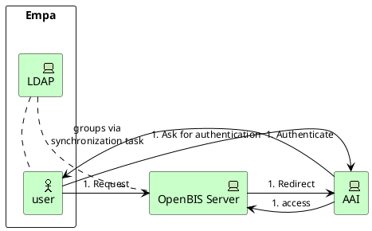

import { Breadcrumbs } from "astro-breadcrumbs";
import "astro-breadcrumbs/breadcrumbs.css";

<Breadcrumbs
  linkTextFormat="sentence"
  customizeListElements={[
    { index: 0, remove: true },
    { index: 1, remove: true },
  ]}
  separatorAriaHidden={false}
/>

Check the 2 ways below to register a new user to your openBIS which **can only be carried out by an instance admin**:

!!! warning
    This only works for users that have an account at Empa. We currently do not have a solution for external users. If you have such a case, please contact us via [email](mailto:openbis-support@empa.ch) and we will try to find a solution for you.

## Registration independently of a group in openBIS using the Admin UI

- If you like to collaborate with an user of another lab, then you can just add the user to your openBIS instance via Admin UI and then assign the necessary user rights via roles (no automatic rights assignment unlike in the other way below). **Check the ETH documentation for user registration in Admin UI [here](https://openbis.readthedocs.io/en/latest/user-documentation/general-admin-users/admins-documentation/user-registration.html#register-users-from-the-admin-ui)**.
  **In Empa case the User Id is the e-mail adress written with "_AT_" instead of @, for example: anusch.bachofner_AT_empa.ch**.
- If someone leaves Empa and ICT deactivates their email address, the person will automatically lose openBIS access. Manual removal of the user is done in the Admin UI.

## Registration to a group in openBIS using the "Project Groups-Management" tool

The tutorial below will show you how to register an user to a group in your openBIS instance.
After completing the steps below, this user will have access to the instance as member of the chosen group with associated default rights.
**Check the ETH documentation for the default rights [here](https://openbis.readthedocs.io/en/latest/user-documentation/general-admin-users/admins-documentation/user-registration.html#default-roles-assigned-in-eln)**.

### Step by step instruction

To perform the steps outlined here, you need to meet the following conditions:

- you **must** be an instance admin

- you **must** perform the following steps on a windows PC connected to the Empa network

If these conditions are met, follow these steps:

1. Note down the name of the user you want to add to your instance
1. Open your file manager and go to `P:\Projects Group Management` (or search for "Projects Group-Management" in Windows search)

   

1. Start the `Empa-ProjectsManagement.exe` program
1. From the `Projekt Ordner` dropdown menu, select the openBIS instance and group you want to add the person to. The name is as follows:
   `OB-L{your lab number}-{your openBIS group}`, where the content in `{}` should be replaced with your lab number and openBIS group.
   For example, to add a person to the instance for lab `402` and group `PolPro` we choose `OB-L402-PolPro` as shown below:
   

1. Now you need to choose the group ending in `Full` in the `groups` table. In the screenshot above, you can see two groups:

   - `EMPA\OB-L402-PolPro-Full` (Choose this one)
   - `EMPA\OB-L402-PolPro-Read` (Ignore it)

  **By choosing a group the user will get automatically user rights assigned in openBIS. Check the ETH documentation for the default rights [here](https://openbis.readthedocs.io/en/latest/user-documentation/general-admin-users/admins-documentation/user-registration.html#default-roles-assigned-in-eln)**.

  

  On the right hand side, you see which users belong to the group so far.
  _For your information: On the left side in the bottom box called `Managers` the instance admins of your openBIS are listed, so they have the right to add users here on the right side (Managers are added by ICT when a new instance admin is requested via [support forms](../../Support.md))_

1.  To add a new person to the selected group, press `Hinzufügen...`.
    A window will open where you can search for the user to add.

        

1.  Type the username in the `Benutzer` field and press `Suchen...`. In the screenshot below I searched myself, `basi`:

    

1.  To add an users, select them in the list of users by clicking on their name. The name will be highlighted in dark blue:

    

1.  Confirm the choice by pressing `OK`

1.  A confirmation popup will appear. Confirm that you want to add the user by pressing `OK`

    

1.  You will have to wait a short time, a progress bar might briefly show.

1.  Verify that the user has been added by checking the user list on the left hand side of the main menu:

    

1.  If you find the user in the list, you can close the `Empa-ProjectsManagement.exe` program or just the tool itself.

1.  After up to 24 hours, your user will be able to login to your openBIS instance with their Empa credentials.

1. Ask the user to try and login. If the login fails, make sure at least 24 hours elapsed since you added them. If this is the case, use the [support form for bugs](../../Support.md) or contact us via [e-mail](mailto:openbis-support@empa.ch).

### Removing an existing user

If someone leaves Empa and ICT deactivates their email address, the person will automatically lose openBIS access.
Steps to remove an existing user manually if the person was added via "Projects Group-Management" tool:

1. Follow the step 1-5 in the instructions [above](#step-by-step-instruction).
1. Now select the group ending in `Full` from the left hand side list
1. Select which user to remove from the right hand side list of users
1. Press the `Entfernen` button
1. After a delay of 24 hours, the user will be removed from your instance

### Technical details

Because the user group management for openBIS at Empa is managed through [LDAP](https://en.wikipedia.org/wiki/Lightweight_Directory_Access_Protocol), we will need to add the new user to the LDAP group corresponding to your instance.

However, openBIS manages users and groups through another internal mechanism. Therefore, the LDAP groups and users are synchronized with the openBIS users on a regular schedule using a so-called _maintenance plugin_ as explained [here](https://unlimited.ethz.ch/display/openBISDoc2010/User+Group+Management+for+Multi-groups+openBIS+Instances#UserGroupManagementforMultigroupsopenBISInstances-ContentoftheReportFilesentbyUsageReportingTask). Thus, when you add a new user to the LDAP group, expect a certain delay until the new user is able to login to your instance.

