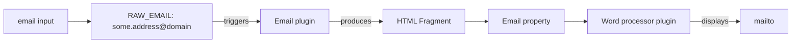

import CustomBreadcrumbs from '@components/CustomBreadcrumbs.astro';
import SidebarHighlighter from '@components/SidebarHighlighter.astro';

<SidebarHighlighter targetPath="/documentation/openbis/how-to-and-use-cases/dynamic_properties" />

<CustomBreadcrumbs
  crumbs={[
    { label: 'openBIS', link: '/documentation/openbis' },
    { label: 'How-to and Use Cases' },
    { label: 'Dynamic Properties', link: '/documentation/openbis/how-to-and-use-cases/dynamic_properties' },
    { label: 'Batch register e-mails with active link', link: '/documentation/openbis/how-to-and-use-cases/dynamic_properties/property_email' },
  ]}
/>

## Introduction

This is a request we received from openBIS users: you have a list of persons and you want to store their email address as a clickable *mailto* hyperlink.

This is already possible in `MULTILINE_VARCHAR` fields using the rich text editor (see [here](https://openbis.readthedocs.io/en/latest/user-documentation/general-admin-users/admins-documentation/new-entity-type-registration.html#enable-rich-text-editor-or-spreadsheet-widgets) to learn how to enable them), but requires the user to manually enter the link, as shown in the image below.


However,  users wanted to automatically generate a *mailto* link when using the Excel batch import feature.
We found a solution to this requirement by using the dynamic property function of openBIS (more info [here](https://openbis.readthedocs.io/en/latest/user-documentation/general-admin-users/properties-handled-by-scripts.html#dynamic-properties)). Follow the step-by-step guide below to learn how.

## How does this solution work?

For this solution to work, we need to define **two email properties** in the object type. One **must** be named `EMAIL_RAW` and will be used as input value for the dynamic property script, giving the script the raw email address that should be displayed as an hyperlink. The other property can have any name and should be assigned the dynamic property script. Any time the value of `EMAIL_RAW` changes, the dynamic property script runs and generates an HTML fragment which is then displayed in the ELN as an hyperlink. The graph below summarizes the process:



## How to setup a clickable email address property

Here is a step by step guide on how to proceed, if you want to setup an object property showing an email address as a mailto link.
The steps in summary are as follow:

1. Create a dynamic property plugin
2. Add a `RAW_EMAIL` property to your object type
3. Add or edit another email property in your object type
4. Assign the plugin to the second email property of you object type
5. Enable the word processor widget for the property, so that the link is displayed as an hyperlink in the ELN

### Define a dynamic property plugin

Access you openBIS admin UI, and go to the **Tools** tab. There, select **Dynamic Property Plugins** from the left menu and press the **Add** button.


In the plugin editor, assign a name to your plugin in the right column.

Now, enter the following code in the **Script** text field:

```python
def check_email(e):
    if e.propertyValue("EMAIL_RAW") == '':
        return False, ''
    else:
        return True, e.propertyValue("EMAIL_RAW")
def calculate():
    valid, email = check_email(entity)
    if valid:
        return "<?xml version=\"1.0\" encoding=\"UTF-8\"?><html><head></head><body><p><a href=\"mailto:{}\">{}</a></p></body></html>".format(email, email)
    else:
        return ""
```

Once you are done, press the **Save** button in the lower right side of the page.

#### Extra: multiple emails

If you want to adapt this approach to manage multiple emails, you can change `check_email` as follows:

```python
def check_email(e):
    input = e.propertyValue("EMAIL")
    emails = input.replace(",", ";")
    return True, emails
```

Now, your input should be a comma-separated list of email instead of a single email

### Add the dynamic property to your object type

Now that you defined the plugin, you need to assign it to a property of the object type.

In order to do so, you first need to add a `VARCHAR` property to your object with the name `EMAIL_RAW`; this property will be used as input for the calculation of the email link.
In the example below, we created a object of type `PERSON` and added this property:


Instead of `PERSON`, you should select the object type you want to attach the email to.

Now we need to add the final email field, the one you want to see displayed as a clickable link in your ELN. To do so, add a property to your object type and choose to use a dynamic property plugin, as shown in the example below:


Once you are done adding these two properties to your object type, save it and leave the Admin UI.

### Enable the word processor in the ELN Settings

Now open your ELN user interface and go to the Settings. In the left menu, these are under **Utilities**, as shown in the screenshot below.


Once you are in the **settings** page, enable the editing of settings, then to the **Instance Settings** section and expand the **UI Widgets** subsection:


Now, click on the **+** button. This will add a new entry at the bottom of the list of available widgets. This allows you to enable the rich text editor (*Word Processor*) to the previously defined `EMAIL` property:


Congratulations, you finished your configuration!

### How to use the email property

If you are loading data using the Excel batch importer, just add the `EMAIL_RAW` column to your table and enter the email addresses in the column. The corresponding formatted email addresses will be displayed as the `EMAIL` property in the ELN.

If you want to modify its value, **only** change the `EMAIL_RAW` property value. The `EMAIL` property which is assigned the property plugin cannot be edited and should not be used during the batch upload process.
