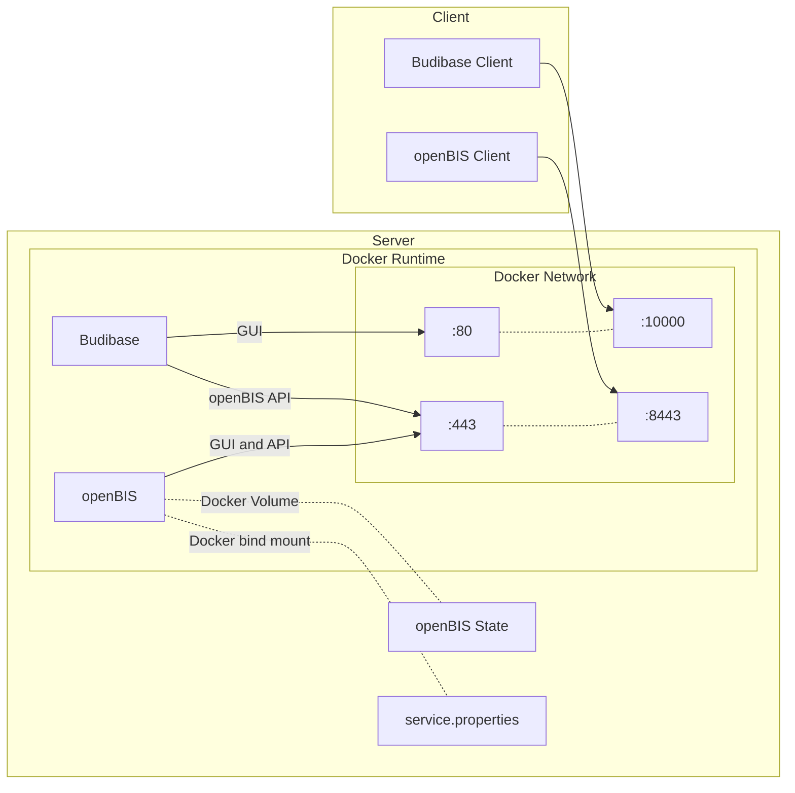

import CustomBreadcrumbs from '@components/CustomBreadcrumbs.astro';
import SidebarHighlighter from '@components/SidebarHighlighter.astro';

<SidebarHighlighter targetPath="/documentation/openbis/how-to-and-use-cases/programming" />

<CustomBreadcrumbs
  crumbs={[
    { label: 'openBIS', link: '/documentation/openbis' },
    { label: 'How-to and Use Cases' },
    { label: 'Programming in openBIS', link: '/documentation/openbis/how-to-and-use-cases/programming' },
    { label: 'Docker and app development with Budibase', link: '/documentation/openbis/how-to-and-use-cases/programming/docker' },
  ]}
/>

### Introduction and motivation

This tutorial is meant for experienced openBIS users that want to develop plugins for openBIS or tools that interact with their openBIS instance without affecting their production instance. The goal is learning how to setup a **local** openBIS instance in a docker container for testing and development on a server or PC.

As an example application connected to openBIS, we include [budibase](https://budibase.com/), a low-code tool that enables you to develop webb apps visually and without having to write a lot of code. We created and include an example app that connects to the local openBIS instance and writes an object based on the user input.

import { Aside } from '@astrojs/starlight/components';

<Aside type="note">
    The testing instance is purely local on the development machine and is in no way connected with your lab's instance.
    However, if you use the [budibase](#budibase-basics) app, you can connect the app to another instance.
</Aside>

For this, we will use the official openBIS docker image which you can find [here](https://hub.docker.com/r/openbis/debian-openbis).

### Prerequisites to understand this tutorial

To understand this tutorial you should at least:

- have a basic understanding of linux and of the linux shell (bash)
- have a basic knowledge of docker
- have a working docker runtime on the machine you want to run the openBIS instance
- install `docker compose` on the development server

### Architecture

The architecture of the development environment is shown below:



The local openBIS instance as well as budibase run on the local docker container runtime and they communicate with each other through the docker network.
In order to access the openBIS instance from outside of the docker runtime, the HTTPS port 443 is exposed by mapping it to another port (in our example 8443), since docker containers running in unprivileged mode can only access [unprivileged ports](https://docs.docker.com/engine/security/rootless/). The same is done for budibase, by exposing the internal port 80 to the port 10000.

Ideally, the app you are developing also runs in a docker container on the same runtime, but this is not strictly necessary as the docker container for openBIS is configured to be accessible from outside of docker.

Because docker containers are ephemeral, the state of the openBIS instance (database, logs, configurations) is persisted through a docker volume outside of the container.

Finally, for ease of configuration, we link the *service.properties* [configuration](https://openbis.readthedocs.io/en/latest/system-admin-documentation/configuration/required-configuration.html#data-store-server-configuration) of the openBIS instance to a file on the development server through a docker bind mount.

## How To

### Getting started

The best way to get started is to clone our example project from gitlab. The example contains two applications:

- openBIS
- budibase

These applications are described by a [docker compose](https://docs.docker.com/compose/) project. With just one command you can start the entire project and start developing quickly.

### Obtaining the project

To get the necessary code and configurations, clone the project to your development machine. On linux/unix systems, use:

```bash
git clone https://gitlab.empa.ch/openbis-tools/openbis-docker-compose.git
```

### Starting openBIS

To use the local openBIS instance, follow these steps:

1. Move to the directory where you cloned the project. In this case, `openbis-docker-compose`:

    ```bash
    cd openbis-docker-compose
    ```

1. Start the openBIS service in the docker compose project

    ```bash
    docker compose up openbis
    ```

1. Wait for all services to start. This would take approximately 2-3 minutes for the first time
1. To verify that openBIS runs, go to this [url](https://localhost:8443) and try to login. The default instance admin is `admin` with password `changeit`.
1. Now, you can use this instance for your tests. To stop the openbis instance, use

    ```bash
    docker compose down openbis
    ```

    otherwise, you can stop the service from docker desktop by pressing on the stop button.

If you want to connect to your openbis instance from another program, you can use this url:

[https://localhost:8443](https://localhost:8443)

You can change the port mapping in the docker-compose.yml file.

### Start budibase

If you want to develop your own webapp connected to openBIS and do not have experience with web development, I advice using budibase. Our docker-compose file contains all the configurations to start budibase in docker alongside openBIS.

To start the budibase service, use:

```bash
docker compose up
```

Wait until both  the openBIS and the budibase services are running. This will typically take one to two minutes. Now you can connect to your budibase instance using your browser by clicking [http://localhost:10000](http://localhost:10000).

## Budibase basics

### Motivation

In the project linked above (see [here](https://gitlab.empa.ch/openbis-tools/openbis-docker-compose.git)), I included a local instance of budibase running on docker. With this tool, you can write your own web applications interacting with openBIS without having to write Javascript/Typescript code and HTML/CSS.

### Get started

#### Prerequisites to start

To get started with budibase, follow the instruction in [How to](#how-to) above.  

#### Import example app

1. After budibase is started, connect to the local budibase instance on `http://localhost:1000`.
1. Budibase will prompt you to create an admin user. Follow the steps and create the admin.
1. Afterwards, you can login to budibase with the credentials created in the previous step:
    

1. Now you can import the example app included in the project. The app file is in `services/budibase/test-app.tar.gz`. To import the app, press `Create new app`
    
1. In the new app creation screen, press `Import app`
    !import app[](src/assets/openBIS/Bild/import_budibase_app.png)
1. Once the import dialog opens, you can drag and drop the file of point 4. in the import area.
    

1. Finally, give a name to your app and press on `Import App`.

1. This will lead you to the main budibase app screen
    

Congratulations! You have successfully imported the example budibase app. To learn more about budibase, please refer to the [documentation](https://docs.budibase.com/docs).

#### Extending the app: search example

##### Starting

The example app is designed to help you get started with webapp development in combination with openBIS. The following features are already available for you to get started:

- Logging in to an instance of your choice and storing the session token
- Listing existing collections

On the basis of these features, we will now learn how to extend the app by adding a screen allowing you to search openBIS objects by their code. In this tutorial you will learn the basics of budibase data and design and the use of the [openBIS V3 API](https://openbis.readthedocs.io/en/latest/software-developer-documentation/apis/java-javascript-v3-api.html)

To follow this tutorial, first follows the steps [above](#import-example-app) to import the example app we included in the git repository to budibase.
When you are done, browse to budibase and then open your app. You will find the imported app by the name you gave it in the import steps.

##### OpenBIS API

Now, before we modify the app, we need a brief side note on the openBIS API[^1] . This is a way for us to perform operations on an openBIS instance *remotely* and *programmatically*: creating and retrieving objects, creating collections, adding metadata etc. Thanks to the API,  we can do everything you would do through the ELN UI interface -- and more -- without a single mouse click, by calling the appropriate methods offered by the API. In the case of the openBIS API, we can use [Java or Javasript](https://openbis.readthedocs.io/en/latest/software-developer-documentation/apis/java-javascript-v3-api.html#openBISV3API-TheJavascriptAPI), or [pyBIS](https://openbis.readthedocs.io/en/latest/software-developer-documentation/apis/python-v3-api.html) to perform these operations. However, because we are working inside of budibase, we cannot write code in any of these languages. Budibase does however support [REST APIs](https://docs.budibase.com/docs/rest) as does openBIS through the JSON-RPC API.

A REST API superficially resembles a normal URL you would use to open a webpage and uses the same principles. The client creates an HTTP request and passes additional information needed to perform the desired operation either through the URL itself the *query parameters*, the *header* of the request or the *body* of the request, as explained in detail [here](https://idratherbewriting.com/learnapidoc/docapis_doc_parameters.html).

In the case of the openBIS API, the  necessary information is passed through the *body* of a POST HTTP request in the form of a JSON object which represents the corresponding openBIS API objects. Therefore, the body of all openBIS JSON-RPC requests looks like this:

```json
{
  "method": "myMethod",
  "params": ["my", "method", "parameters"],
  "id": "referenceID",
  "jsonrpc": "2.0"
}
```

where `method` is the name of the API method to be called, which corresponds to the methods available in the openBIS JAVA API. For a list of methods, please refer to the openBIS  javadoc for the [IApplicationServerApi](https://openbis.ch/javadoc/20.10.x/javadoc-api-v3/ch/ethz/sis/openbis/generic/asapi/v3/IApplicationServerApi.html) interface

##### Using the API

Suppose now that we want to search objects in our instance by their code. We check the java doc and find the following method:
[searchSamples](https://openbis.ch/javadoc/20.10.x/javadoc-api-v3/ch/ethz/sis/openbis/generic/asapi/v3/IApplicationServerApi.html#searchSamples(java.lang.String,ch.ethz.sis.openbis.generic.asapi.v3.dto.sample.search.SampleSearchCriteria,ch.ethz.sis.openbis.generic.asapi.v3.dto.sample.fetchoptions.SampleFetchOptions)).

The documentation tells us that the method takes three parameters:

1. `sessionToken`
2. `searchCriteria`
3. `fetchOptions`

This  is a common pattern for all openBIS API methods. We almost always pass the `sessionToken` string to authenticate and then a  series of options to configure how the operation should be performed. Let's see in more detail how this looks like for a search operation.

The first parameter, `sessionToken` is the session token that we obtain by logging in to openBIS. In budibase, the token is already available because I implemented a login screen for you. In the webapp, you can retrieve the token from the `State` object under `openbisToken`.

The second parameter `searchCriteria` contains the [`SampleSearchCriteria`](https://openbis.ch/javadoc/20.10.x/javadoc-api-v3/ch/ethz/sis/openbis/generic/asapi/v3/dto/sample/search/SampleSearchCriteria.html) object that tell the openBIS API how to find the object.

Finally, `fetchOptions` gives the [`SampleFetchOptions`](https://openbis.ch/javadoc/20.10.x/javadoc-api-v3/ch/ethz/sis/openbis/generic/asapi/v3/dto/sample/fetchoptions/SampleFetchOptions.html) object that configures how the results from the search should be returned to us.

[^1]: Application programming interface. See [wikipedia](https://en.wikipedia.org/wiki/API) for a better definition.
